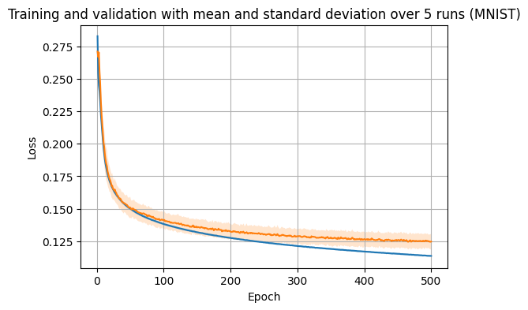
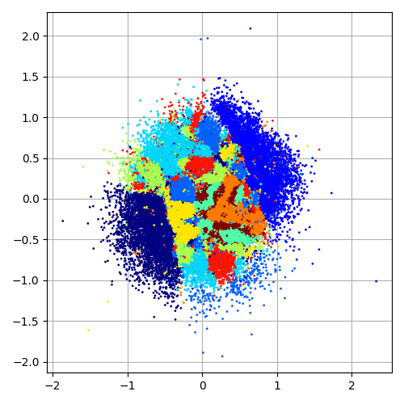
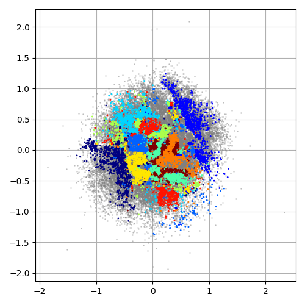

# Decoder only image reconstruction

© 2024 Saurabh Pathak. All rights reserved

## Table of Contents

1. [Overview](#overview)
2. [Installation](#installation)
3. [Project Structure](#project-structure)
4. [Usage](#usage)
5. [Hyperparameters](#hyperparameters)
6. [Examples](#examples)
8. [Footnote](#footnote)

## Overview

This project implements a decoder only approach for
image reconstruction. Instead of using an encoder to map
the input space onto the latent space and then a decoder
to do the inverse process, as is common in autoencoder
architectures, I will use a standalone decoder
architecture to directly map vectors from the latent
space onto the data space.The network is trained using a
unique approach where both the weights of the decoder
and the input latent vectors are updated through
backpropagation.

### Motivation for decoder only image reconstruction

The motivation behind this approach stems from the field of
adversarial machine learning, where small perturbations are
made to the input to produce a desired output. However,
unlike traditional adversarial attacks, this project aims to
utilize this concept for a constructive purpose. By updating
both the weights of the decoder and the input latent
vectors, we encourage the latent input vector corresponding
to an image to settle in an ideal location that minimizes
the decoder's reconstruction loss on that image. This
approach has the potential to lead to a more efficient and
effective way of learning representations in the latent
space, ultimately resulting in better image reconstruction
quality.

### Potential Advantages

Compared to traditional autoencoder approaches, this method
may offer several advantages:

1. Flexibility in latent space structure: By directly
   optimizing the input latent vectors, we can potentially
   learn more complex and flexible representations in the
   latent space, rather than being limited by the fixed
   encoding scheme of a traditional autoencoder.
2. Improved reconstruction quality: By updating both the
   weights and the input latent vectors, we can adaptively
   refine the reconstruction process, leading to potentially
   better reconstruction quality compared to traditional
   autoencoders.
3. Reduced mode collapse: The joint optimization of
   weights and input latent vectors may help mitigate
   mode collapse, a
   common issue in traditional autoencoders where the model
   converges to a limited subset of possible outputs.
4. Simplified training: The decoder-only architecture
   eliminates the need to train an encoder, which can
   simplify
   the training process and reduce the number of parameters
   to
   be learned.

These potential advantages are currently being explored and
validated through experiments, and the results will be
reported in future updates.

### Evaluation Scheme

Evaluating the performance of our decoder-only network on
the validation set poses a unique challenge due to the joint
optimization of weights and input latent vectors during
training. To address this, we adopt a modified evaluation
approach that closely mirrors the training procedure. Similar to the training set, we
initialize the latent vectors for the validation set and
update them through backpropagation during a validation
cycle, however, we freeze the weights of the decoder
network during validation. The goal is to
minimize the reconstruction error on the validation set.
This process is similar to the training procedure, but with
the key difference that the weights of the model are not
updated.

The underlying assumption behind this evaluation scheme is
that, given the optimal set of weights learned during
training, there should exist a latent vector that can
minimize the reconstruction error on the validation set. By
updating only the latent vectors during validation, we aim
to find this optimal latent representation that best
reconstructs the validation images using the fixed weights.

## Installation

We use TF2.14 and Python 3.11 based setup. Using a docker
environment is highly recommended. To that end, a
`Dockerfile` and a pipenv `Pipfile` is provided. Please see
them for details. When built using the given `Dockerfile`,
it should automatically take care of all dependencies.

```bash
docker build -t <name>:<tag> .
```

Once the image is built, an interactive container should be
created:

```bash
docker run -itv <code_folder_root> --network host --gpus all --name <cname> <name>:<tag>
```

## Project Structure

- `dataloader.py`: Handles data loading and
  preprocessing `tf.data` pipeline. Currently provisioned to
  work with
  MNIST, CIFAR10/100, FASHION_MNIST
- `hparams.py`: Defines hyperparameters for the models and
  training/tuning process.
- `hypermodels.py`: Implements hypermodels for tuning.
- `sequential.py`: Defines the sequential FC neural network
  model.
- `train.py`: Contains the training model and
  logic for handling training and validation with latent 
  input vectors.
- `tune.py`: Implements hyperparameter tuning
  functionality using keras tuner's gridsearch.
- `utils.py`: miscellaneous functions used throughout
  the project.
- `gridsearch.py`: essentially a copy of keras_tuner's
  gridsearch functionality except a few bookkeeping
  enhancements, such as recording training histories of
  all models built and trained during the running
  experiment, random trial_ids replacing sequential
  trial_ids for tensorboard visualization, etc.
- `demo.ipynb`: shows minimal example on how to tune
  and plot histories directly using code.

## Usage

The primary design objective is to be able to tune the best
possible value of the learning rate through gridsearch 
that minimizes the reconstruction loss (MSE).
The following training command pattern is to be used:

```bash
./train.py --objective <tuner_objective, eg., loss|val_loss> \
--dataset <dataset,e.g., mnist> [optional_args]
```

where optional arguments may include hparams that one
wants to
fix instead of using defaults defined in `hparams.py`.
See `hparams.py` for their default values.

*Note: Not all parameters defined in `hparams.py` can be
overridden through commandline, but one can always edit
the file directly for such scenarios.*

### Example: reconstruction on MNIST dataset

For a more advanced interaction with this project, we
can directly utilize the code instead of the `tune.py`
script.
To that end, `demo.ipynb` contains a minimal
demonstration of how to do so. In it, we show
reconstruction task on the MNIST dataset.
We consider optimizing
the loss and find the best learning rate in doing so. We
consider a two-dimensional input space in our example.
The following figure shows the training progress over
500 epochs with 5 different weight initialization points.
In all cases the latent spaces were initialized to zero
vectors.



The following figure shows the input vectors in the latent
space corresponding to the training set after training
through 500 epochs. The colors denote samples belonging
to different classes. As is
clear, the samples belonging to the same class tend to "clump" together, resulting in the clusters we see below.



The following figure shows the vectors corresponding to the
validation data in class-wise colored scheme overlaid on 
the gray cloud of the
training set to show that samples from the validation set
tend to follow visually similar cluster distribution as seen
in the training samples.



## Hyperparameters

Specifically, we can choose the following
hyperparameters on the command line, with the exception
of the learning rate, which when not specified can be
tuned using grid search. All these parameters along with 
their default values are defined in `hparams.py`. There 
are some others such as `use_xla` and `batchnorm`, that are 
not defined 
in `hparams.py` but can still be specified on the command 
line and vice-versa. Here I have attempted to give a 
comprehensive listing of all the parameters and 
hyperparameters defined and used in the repo code.

- dataset: required. one of mnist, fmnist, cifar10 or 
  cifar100
- objective: tuner objective, e.g., loss, val_loss, etc. 
  required to be specified on the command line.
- latent dims: integer representing input space
  dimensionality, defaults to 2 if not specified.
- architecture: FC architectures are supported.
  specified as `n_units-n_units-....-n_units` string. 
  required to be specified on the command line.
- activation: defaults to `leaky_relu`.
- batchnorm: defaults to `True`.
- learning rate: default setting is to
  gridsearch between `(min_value=1e-4,
  max_value=.1,
  step=10,
  sampling='log')`
- dropout regularization rate: default to 0 (disabled).
- visualize after epochs: is used in `VisualizationCallback`
  for periodically visualizing the latent space if the
  space is in 2D. (cant be specified on cmdline). 
  defaults to 20.
- histogram freq: frequency with which to write histogram
  summaries to tensorboard. (cant be specified on 
  cmdline). defaults to 20.
- examples frac: how much of the total data to utilize, 
  varies between 0 and 1. defaults to 0.5
- epochs: defaults to 300.
- batch size: defaults to 128.
- use xla: whether to XLA acceleration with GPU/CPU. 
  Defaults to `True`.
- use bias: defaults to `True`
- random seed: defaults to `None`.
- executions per trial: how many times to run a given 
  keras-tuner hyperparameter configuration when doing 
  grid search. defaults to 3.
- augmentations: one or more can be enabled/disabled 
  through `hparams.py`. defaults is none.
- early stopping: defaults to `False`.
- save best model: whether to save or ignore the best 
  model during the training process. defaults to `False`.
- reset training: if `True`, clears out the project 
  directory before starting a keras-tuner session. 
  defaults to `False`.
- trackers: track gradient norms. default: `None`.

## Examples

```bash
# lr not specified, will tune
./train.py --dataset mnist --num_epochs 100 --activation relu \
--examples_frac .5 --executions_per_trial 1 \
--batch_norm --objective val_loss --arch 500-500
```

```bash
# lr specified, will not tune
./train.py --dataset cifar10 --num_epochs 50 \
 --lr 1e-3 --activation tanh\
--examples_frac 0. --executions_per_trial 3 \
--nobatch_norm --objective loss --arch 500-500-1000-500
```

```bash
# will track gradient norms
./train.py --dataset cifar100 --num_epochs 150 \
 --lr 1e-4 --activation swish \
--examples_frac 0. --executions_per_trial 1 \
--nobatch_norm --objective loss --arch 500-500-1000-500 \
--tracker gradients
```

```bash
# will clear out project dir and not use xla
./train.py --reset-training --nouse_xla --dataset fmnist \
--num_epochs 150 --activation swish \
--examples_frac 0.5 --executions_per_trial 10 \
--batch_norm --objective val_error --arch 500-1500-1000
```

## Footnote

Thanks for reading the README. This software is "AS IS"
and may contain issues. I will fix them as I come across
or if you bring them to my notice. I am deeply
interested in efficient training algorithms for deep
learning that draw inspiration from but are not limited by
natural counterparts of neural nets, as well as sustainable
and decentralized AI in general. As such, I would greatly
welcome research and collaboration opportunities in this
domain. Please
[contact](mailto:saurabhpathak.personal@gmail.com) me if you
think I can be of value.

Cheers!